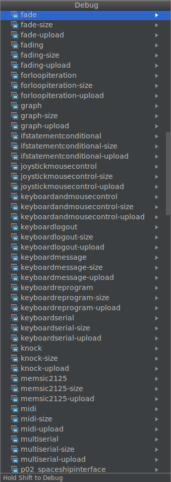

# arduino-cmake-examples
All the arduino example projects available as a cmake project plus my first arduino program

### SDK version
Examples based on arduino SDK version 1.8.5

### Usage
Run CMake with the following option: `-DARDUINO_SDK_PATH=/path/to/arduino-sdk-version`

### Thanks
Wouldn't have been possible without the work done at:

- https://github.com/arduino-cmake/arduino-cmake
